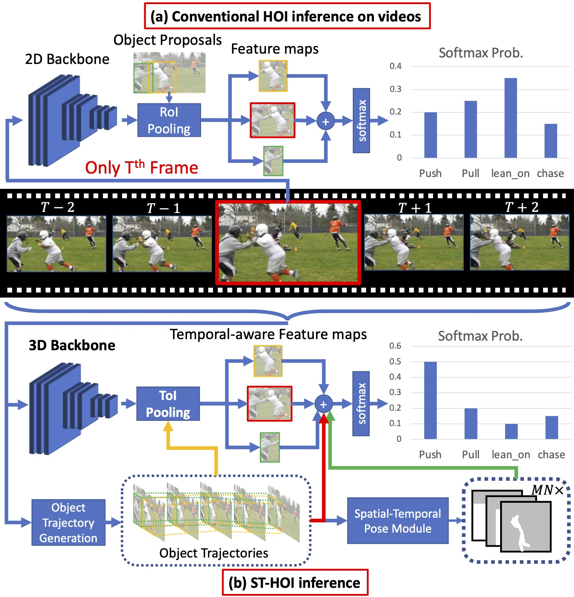
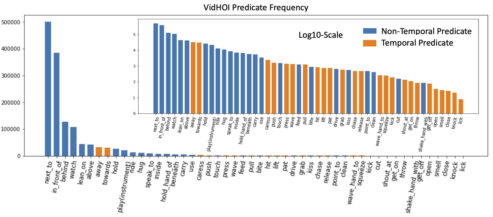

# Human-Object Interaction in Videos (ST-HOI/VidHOI)

<div align="center">
    
**ST-HOI**: A **S**patial-**T**emporal Baseline for **H**uman-**O**bject **I**nteraction Detection in Videos<br>
[[Paper]](https://dl.acm.org/doi/pdf/10.1145/3463944.3469097) [[Slides]](figs/slide.pdf) [[Video]](https://dl.acm.org/doi/10.1145/3463944.3469097#sec-supp)<br><br>
[Meng-Jiun Chiou](http://coldmanck.github.io/)<sup>1</sup>, Chun-Yu Liao<sup>2</sup>, Li-Wei Wang<sup>2</sup>, [Roger Zimmermann](https://www.comp.nus.edu.sg/~rogerz/roger.html)<sup>1</sup> and [Jiashi Feng](https://sites.google.com/site/jshfeng/home)<sup>1</sup><br>
<sup>1</sup>National University of Singapore <sup>2</sup>ASUS Intelligent Cloud Services<br><br>
appears at [ACM ICMR 2021 Workshop on Intelligent Cross-Data Analysis and Retrieval](https://dl.acm.org/doi/proceedings/10.1145/3463944)
</div>

<div align="center">
    <br>
</div>

**ST-HOI** is a strong, spatial-temporal-aware human-object interaction (HOI) detection baseline. To take into account accurate spatial-temporal information, ST-HOI exploits trajectory-based features including correctly-localized visual features, spatial-temporal masking pose features and trajectory features.

**VidHOI** is one of the first large-scale *video-based* HOI detection benchmark. Note that in contrast to action detection datasets such as AVA/Kinetics, the interacting objects are explicitly annotated in VidHOI. We sampled and transformed video HOIs (*i.e.*, image HOIs in continuous frames) from an existing video dataset, [VidOR](https://xdshang.github.io/docs/vidor.html).

<div align="center">
    
</div>

<div align="center">
    
</div>

Note that each experiment was performed with eight NVIDIA Tesla V100 GPU with 32G memory. Before running the training commands ensure that your GPUs have enough memories. Otherwise, you might need to reduce the batch size accordingly. In contrast, only 1 GPU with less than 4GB GPU is used for validation commands as we evaluate with batch size of 1. 

## To-dos
- [ ] Automate evaluation process (instead of using [vidor_eval.ipynb](vidor_eval.ipynb))
- [ ] Clean visualization tools

## Installation
1. Create a conda environment
```
conda create -n vidhoi python=3.6 scipy numpy
conda activate vidhoi
```
2. Install PyTorch 1.4.0 and torchvision 0.5.0 following [the official installation guide](https://pytorch.org/get-started/previous-versions/)
3. Install other requirements via `pip install -r requirements.txt` **(Note: remove torch/torchvision/torchaudio and other mismatched package requirements before proceeding!)**
4. Install SlowFast and detectron2 following the instructions in [OLD_README.md](OLD_README.md). **(Note: skip the step of cloning a detectron2_repo/ from FacebookResearch. Install our provided detectron2_repo/ in this repository.)**

## Download VidHOI Benchmark
Please refer to Section 4.1 of [our paper](https://arxiv.org/pdf/2105.11731.pdf) for more detail about the proposed benchmark.

First, download the original VidOR dataset and annotations from [the official website](https://xdshang.github.io/docs/vidor.html) and unzip to `$ROOT/slowfast/dataset/vidor-github`. To download VidHOI (i.e., HOI-specific) annotations, refer to files under the same folder in this repoistory, and for larger files, download them from [here](https://drive.google.com/drive/folders/1PGZ-5vGXphL5dgUWrlePZn5lQ2ejq62K?usp=sharing). 

### Files
- Sampled frame lists
  - `frame_lists/train.csv`
  - `frame_lists/val.csv`
- Human/object frame-wise annotations for training/validation
  - `train_frame_annots.json` 
  - `val_frame_annots.json`
- Human/object trajectories for training/validation
  - `train_trajectories.json`
  - `val_trajectories.json`
- For removing testing frames with missing predicted boxes (during evaluation with precomputed boxes; details below)
  - `val_instances_predictions_train_small_vidor_with_pseudo_labels.pth`

One then needs to extract frames from VidOR videos using `$ROOT/slowfast/dataset/vidor-github/extract_vidor_frames.sh`.

### Notes (Important!)
Since ST-HOI baselines that are evaluated with predicted trajectories (during validation) miss bounding boxes for some validation frames, to make their results comparable with the results using ground truth boxes, we remove those testing frames that *no any bounding box got predicted by the trajectory generation model*, i.e., we evaluate our all baselines only on those testing frames with at least one predicted boxes. This results in 168 less testing examples (22,967 -> 22,808 frames). Moreover, for models with Spatial-Temporal Masking Pose Module, further 1,050 out of 22,808 testing frames cannot be used as our human pose estimation model doesn't output any valid, predicted human pose. For fair comparisons, we only evaluate on the final 21,758 frames. This is done by changing the default value of `VIDOR.TEST_PREDICT_BOX_LISTS` from `val_frame_annots.json` to `val_instances_predictions_train_small_vidor_with_pseudo_labels.pth`. To validate models on all 22,967 frames (with ground truth trajectories), pass 
- `VIDOR.TEST_PREDICT_BOX_LISTS val_frame_annots.json` 
- `VIDOR.TEST_GT_LESS_TO_ALIGN_NONGT False`

to configs when starting a validation session.

## Download ST-HOI Baselines
### Files
To reproduce results of ST-HOI baselines, please download essential files from [here](https://drive.google.com/drive/folders/1ONaZFOF5Kj0mxQZjl2F83vQxaz6jAQHE?usp=sharing) and put (after unzipping, if applicable) the files to the same folder (`vidor-github`) as above. 

Note that if you'd only like to testing with ground truth trajectories, you only need to download `human_poses.zip`!

- `det_val_trajectories.json`: detected trajectories (validation split)
- `det_val_frame_annots.json`: detected frame-wise annotations (validation split)
- Human poses
  - `human_poses.zip`: generated human poses using ground truth boxes/trajectories
  - `human_poses_detected-bboxes.zip`: generated human poses using detected boxes/trajectories
  - `vidor_training_3d_human_poses_from_VIBE.pkl`: (optional) 3D human poses generated with VIBE (training split)
  - `vidor_validation_3d_human_poses_from_VIBE.pkl`: (optional) 3D human poses generated with VIBE (validation split)
- `detection_results.zip`: raw detected boxes results (optional as it's been transformed into `det_val_trajectories,json` and `det_val_frame_annots.json`)
- `vidvrd-mff.zip`: (optional) the top-1 solution in [Relation Understanding in Videos ACM MM 2019 Grand Challenge](https://nextplusplus.github.io/VidVRD-helper/mm19-gdc/index.html) which includes the detected human/object trajectories used in our project. This zip file is the same as the file [here](https://zdtnag7mmr.larksuite.com/file/boxusugavBW2RyKEE277UdPROyb).

Note that for the *Detection* results in Table 2, we evaluate the models (trained with ground truth boxes/trajectories) on detected boxes/trajectories. That's why we only need detected boxes/trajectories for VidHOI validation split.

### Checkpoints
Trained models are provided for performance verification purpose without running training, and only 1 GPU is used during validation. Download the checkpoints from [here](https://drive.google.com/file/d/1p848ph27tOH1ODXPfIoLv59piMCexlfr/view?usp=sharing) and extract them under `$ROOT/checkpoints/`.

- `checkpoints.zip`: Final trained models' weights

### Performance Validation
For the ease of verifying models' performance, we have uploaded the output json files of 2D/3D baselins and ST-HOI models (evaluated with ground truth boxes) [here](https://drive.google.com/drive/folders/1ONaZFOF5Kj0mxQZjl2F83vQxaz6jAQHE?usp=sharing) (under the `output` folder). One may directly download these files and refer to [vidor_eval.ipynb](vidor_eval.ipynb) for evaluation and visualization.

## Experiments
First, rename the folder `vidor-github` under `$ROOT/slowfast/dataset` to `vidor` before running any command. The following commands use ground truth `GT` (Oracle mode) by default. To use detected trajectories, refer to `NONGT` version of each model.

Second, rename the paths in [defaults.py](slowfast/confic/defaults.py): specifically, search for `aicsvidhoi1` and replace the matched paths with yours.

For checking each model's final performance including mAP, use [vidor_eval.ipynb](vidor_eval.ipynb) (TODO: write an automatic evaluation script)

### Image Baseline (2D Model)
- Training: Run 
```
python tools/run_net_vidor.py --cfg configs/vidor/BASELINE_32x2_R50_SHORT_SCRATCH_EVAL_GT.yaml DATA.PATH_TO_DATA_DIR slowfast/datasets/vidor NUM_GPUS 1 DATA_LOADER.NUM_WORKERS 0 TRAIN.BATCH_SIZE 128 TEST.BATCH_SIZE 1 LOG_MODEL_INFO False
```
- Validation: Run 
```
python tools/run_net_vidor.py --cfg configs/vidor/BASELINE_32x2_R50_SHORT_SCRATCH_EVAL_GT.yaml DATA.PATH_TO_DATA_DIR slowfast/datasets/vidor NUM_GPUS 1 DATA_LOADER.NUM_WORKERS 0 TEST.BATCH_SIZE 1 LOG_MODEL_INFO False TRAIN.ENABLE False TEST.CHECKPOINT_FILE_PATH ./checkpoints/BASELINE_32x2_R50_SHORT_SCRATCH_EVAL_GT/checkpoint_epoch_00020.pyth TRAIN.CHECKPOINT_TYPE pytorch VIDOR.TEST_DEBUG False
```
- NON-GT version: `BASELINE_32x2_R50_SHORT_SCRATCH_EVAL_NONGT`

### Video Baseline (3D Model)
- Training: Run 
```
python tools/run_net_vidor.py --cfg configs/vidor/SLOWFAST_32x2_R50_SHORT_SCRATCH_EVAL_GT.yaml DATA.PATH_TO_DATA_DIR slowfast/datasets/vidor NUM_GPUS 8 DATA_LOADER.NUM_WORKERS 0 TRAIN.BATCH_SIZE 128 TEST.BATCH_SIZE 1 LOG_MODEL_INFO False
```
- Validation: Run 
```
python tools/run_net_vidor.py --cfg configs/vidor/SLOWFAST_32x2_R50_SHORT_SCRATCH_EVAL_GT.yaml DATA.PATH_TO_DATA_DIR slowfast/datasets/vidor NUM_GPUS 1 DATA_LOADER.NUM_WORKERS 0 TEST.BATCH_SIZE 1 LOG_MODEL_INFO False TRAIN.ENABLE False TEST.CHECKPOINT_FILE_PATH ./checkpoints/SLOWFAST_32x2_R50_SHORT_SCRATCH_EVAL_GT/checkpoint_epoch_00020.pyth TRAIN.CHECKPOINT_TYPE pytorch VIDOR.TEST_DEBUG False
```
- NON-GT version: `SLOWFAST_32x2_R50_SHORT_SCRATCH_EVAL_NONGT`

### 3D + Trajectory (Ours-T)
- Training: Run 
```
python tools/run_net_vidor.py --cfg configs/vidor/SLOWFAST_32x2_R50_SHORT_SCRATCH_EVAL_GT_trajectory.yaml DATA.PATH_TO_DATA_DIR slowfast/datasets/vidor NUM_GPUS 8 DATA_LOADER.NUM_WORKERS 0 TRAIN.BATCH_SIZE 128 TEST.BATCH_SIZE 1 LOG_MODEL_INFO False VIDOR.TEST_DEBUG False
```
- Validation: Run 
```
python tools/run_net_vidor.py --cfg configs/vidor/SLOWFAST_32x2_R50_SHORT_SCRATCH_EVAL_GT_trajectory.yaml DATA.PATH_TO_DATA_DIR slowfast/datasets/vidor NUM_GPUS 1 DATA_LOADER.NUM_WORKERS 0 TEST.BATCH_SIZE 1 LOG_MODEL_INFO False TRAIN.ENABLE False TEST.CHECKPOINT_FILE_PATH ./checkpoints/SLOWFAST_32x2_R50_SHORT_SCRATCH_EVAL_GT_trajectory/checkpoint_epoch_00020.pyth TRAIN.CHECKPOINT_TYPE pytorch VIDOR.TEST_DEBUG False
```
- NON-GT version: `SLOWFAST_32x2_R50_SHORT_SCRATCH_EVAL_NONGT_trajectory`

### 3D + Trajectory + ToI Features (Ours-T+V)
- Training: Run 
```
python tools/run_net_vidor.py --cfg configs/vidor/SLOWFAST_32x2_R50_SHORT_SCRATCH_EVAL_GT_trajectory-toipool.yaml DATA.PATH_TO_DATA_DIR slowfast/datasets/vidor NUM_GPUS 8 DATA_LOADER.NUM_WORKERS 0 TRAIN.BATCH_SIZE 128 TEST.BATCH_SIZE 1 LOG_MODEL_INFO False VIDOR.TEST_DEBUG False
```
- Validation: Run 
```
python tools/run_net_vidor.py --cfg configs/vidor/SLOWFAST_32x2_R50_SHORT_SCRATCH_EVAL_GT_trajectory-toipool.yaml DATA.PATH_TO_DATA_DIR slowfast/datasets/vidor NUM_GPUS 1 DATA_LOADER.NUM_WORKERS 0 TEST.BATCH_SIZE 1 LOG_MODEL_INFO False TRAIN.ENABLE False TEST.CHECKPOINT_FILE_PATH ./checkpoints/SLOWFAST_32x2_R50_SHORT_SCRATCH_EVAL_GT_trajectory-toipool/checkpoint_epoch_00020.pyth TRAIN.CHECKPOINT_TYPE pytorch VIDOR.TEST_DEBUG False
```
- NON-GT version: `SLOWFAST_32x2_R50_SHORT_SCRATCH_EVAL_NONGT_trajectory-toipool`

### 3D + Trajectory + Masking Pose Feature (Ours-T+P)
- Training: Run 
```
python tools/run_net_vidor.py --cfg configs/vidor/SLOWFAST_32x2_R50_SHORT_SCRATCH_EVAL_GT_trajectory-spa_conf.yaml DATA.PATH_TO_DATA_DIR slowfast/datasets/vidor NUM_GPUS 8 DATA_LOADER.NUM_WORKERS 0 TRAIN.BATCH_SIZE 96 TEST.BATCH_SIZE 1 LOG_MODEL_INFO False VIDOR.TEST_DEBUG False
```
- Validation: Run 
```
python tools/run_net_vidor.py --cfg configs/vidor/SLOWFAST_32x2_R50_SHORT_SCRATCH_EVAL_GT_trajectory-spa_conf.yaml DATA.PATH_TO_DATA_DIR slowfast/datasets/vidor NUM_GPUS 1 DATA_LOADER.NUM_WORKERS 0 TEST.BATCH_SIZE 1 LOG_MODEL_INFO False TRAIN.ENABLE False TEST.CHECKPOINT_FILE_PATH ./checkpoints/SLOWFAST_32x2_R50_SHORT_SCRATCH_EVAL_GT_trajectory-spa_conf/checkpoint_epoch_00020.pyth TRAIN.CHECKPOINT_TYPE pytorch VIDOR.TEST_DEBUG False
```
- NON-GT version: `SLOWFAST_32x2_R50_SHORT_SCRATCH_EVAL_NONGT_trajectory-spa_conf`

### 3D + Trajectory + ToI Features + Masking Pose Feature (Ours-T+V+P)
Note that batch size is 112 for the this model.
- Training: Run 
```
python tools/run_net_vidor.py --cfg configs/vidor/SLOWFAST_32x2_R50_SHORT_SCRATCH_EVAL_GT_trajectory-toipool-spa_conf.yaml DATA.PATH_TO_DATA_DIR slowfast/datasets/vidor NUM_GPUS 7 DATA_LOADER.NUM_WORKERS 0 TRAIN.BATCH_SIZE 112 TEST.BATCH_SIZE 1 LOG_MODEL_INFO False VIDOR.TEST_DEBUG False
```
- Validation: Run 
```
python tools/run_net_vidor.py --cfg configs/vidor/SLOWFAST_32x2_R50_SHORT_SCRATCH_EVAL_GT_trajectory-toipool-spa_conf.yaml DATA.PATH_TO_DATA_DIR slowfast/datasets/vidor NUM_GPUS 1 DATA_LOADER.NUM_WORKERS 0 TEST.BATCH_SIZE 1 LOG_MODEL_INFO False TRAIN.ENABLE False TEST.CHECKPOINT_FILE_PATH ./checkpoints/SLOWFAST_32x2_R50_SHORT_SCRATCH_EVAL_GT_trajectory-toipool-spa_conf/checkpoint_epoch_00020.pyth TRAIN.CHECKPOINT_TYPE pytorch VIDOR.TEST_DEBUG False
```
- NON-GT version: `SLOWFAST_32x2_R50_SHORT_SCRATCH_EVAL_NONGT_trajectory-toipool-spa_conf`


## Optional Experiments

<details>
<summary>
Generating Human Poses
</summary>

FastPose from [AlphaPose](https://github.com/MVIG-SJTU/AlphaPose) is used. One may choose to 
- clone [AlphaPose](https://github.com/coldmanck/AlphaPose) to a separate directory, download the pretrained 2D human pose estimation model (e.g., `fast_res50_256x192.pth`) and put into `pretrained_models`; or
- Download AlphaPose.zip from [google drive](https://drive.google.com/file/d/1R71xJhJw_VnYNJQJJ2KwU7Wehb1Th1it/view?usp=sharing) and unzip it to a separate directory

Then install and activate a new environment for AlphaPose following [the installation guide](https://github.com/coldmanck/AlphaPose/blob/master/docs/INSTALL.md), followed by running the commands:
- Demo some pictures:
```
./scripts/inference.sh configs/coco/resnet/256x192_res50_lr1e-3_1x.yaml pretrained_models/fast_res50_256x192.pth ~/datasets/vidor/video/0001/4164158586.mp4 results
```
or
```
python scripts/demo_inference.py --cfg configs/coco/resnet/256x192_res50_lr1e-3_1x.yaml --checkpoint pretrained_models/fast_res50_256x192.pth --video ~/datasets/vidor/video/0001/4164158586.mp4 --outdir results --detector yolo --save_video
```

- Inference
```
python scripts/demo_inference_vidor.py --cfg configs/coco/resnet/256x192_res50_lr1e-3_1x.yaml --checkpoint pretrained_models/fast_res50_256x192.pth --outdir results_gt --detector yolo --split training --gpus 0,1,2,3,4,5,6,7 --qsize 40960 --posebatch 1280
```
Note that one can change `--split` from training to validation.

- Multi-gpu "distributed" inference
```
python scripts/demo_inference_vidor.py --cfg configs/coco/resnet/256x192_res50_lr1e-3_1x.yaml --checkpoint pretrained_models/fast_res50_256x192.pth --outdir results_gt --detector yolo --split validation --gpus 7 --qsize 40960 --posebatch 1280 --start_folder_idx 0 --end_folder_idx 29
```
</details>

\*\***The experiments below are not included in the main paper and only serve as record purpose.**\*\*

<details>
<summary>
3D + Trajectory + Human Poses (from VIBE)
</summary>
    
### [Pre-requisite]
Run VIBE with the following commands at `~/VIBE` to generate human poses for VidOR dataset and move the generated pose to the vidor dataset folder:
- `python demo_vidor.py --output_folder output/ --gt_tracklet --mode training`
- `python demo_vidor.py --output_folder output/ --gt_tracklet --mode validation`

### Running
Then run the following:
- Training: Run 
```
python tools/run_net_vidor.py --cfg configs/vidor/SLOWFAST_32x2_R50_SHORT_SCRATCH_EVAL_GT_trajectory-human_pose.yaml DATA.PATH_TO_DATA_DIR slowfast/datasets/vidor NUM_GPUS 8 DATA_LOADER.NUM_WORKERS 0 TRAIN.BATCH_SIZE 128 TEST.BATCH_SIZE 1 LOG_MODEL_INFO False VIDOR.TEST_DEBUG False
```
- Validation: Run 
```
python tools/run_net_vidor.py --cfg configs/vidor/SLOWFAST_32x2_R50_SHORT_SCRATCH_EVAL_GT_trajectory-human_pose.yaml DATA.PATH_TO_DATA_DIR slowfast/datasets/vidor NUM_GPUS 1 DATA_LOADER.NUM_WORKERS 0 TEST.BATCH_SIZE 1 LOG_MODEL_INFO False TRAIN.ENABLE False TEST.CHECKPOINT_FILE_PATH ./output/SLOWFAST_32x2_R50_SHORT_SCRATCH_EVAL_GT_trajectory-human_pose/checkpoints/checkpoint_epoch_00020.pyth TRAIN.CHECKPOINT_TYPE pytorch VIDOR.TEST_DEBUG False
```
</details>

<details>
<summary>
Video baseline + Trajectory + Relativity Feature
</summary>

- Training: 
```
python tools/run_net_vidor.py --cfg configs/vidor/SLOWFAST_32x2_R50_SHORT_SCRATCH_EVAL_GT_relativity-feat.yaml DATA.PATH_TO_DATA_DIR slowfast/datasets/vidor NUM_GPUS 8 DATA_LOADER.NUM_WORKERS 0 TRAIN.BATCH_SIZE 128 TEST.BATCH_SIZE 1 LOG_MODEL_INFO False VIDOR.TEST_DEBUG False
```
    
- Validation: 

```
python tools/run_net_vidor.py --cfg configs/vidor/SLOWFAST_32x2_R50_SHORT_SCRATCH_EVAL_GT_relativity-feat.yaml DATA.PATH_TO_DATA_DIR slowfast/datasets/vidor NUM_GPUS 1 DATA_LOADER.NUM_WORKERS 0 TEST.BATCH_SIZE 1 LOG_MODEL_INFO False TRAIN.ENABLE False TEST.CHECKPOINT_FILE_PATH ./output/SLOWFAST_32x2_R50_SHORT_SCRATCH_EVAL_GT_relativity-feat/checkpoints/checkpoint_epoch_00020.pyth TRAIN.CHECKPOINT_TYPE pytorch VIDOR.TEST_DEBUG False
```
</details>

<details>
<summary>
Human Poses Inference from HRNet
</summary>

```
# Clone the HRNet repo first
git clone https://github.com/leoxiaobin/deep-high-resolution-net.pytorch.git
# And download corresponding pretrained model weights
```
### Original inference command
```
python inference.py --cfg inference-config.yaml --videoFile ../videos/3418738633.mp4 --writeBoxFrames --outputDir output TEST.MODEL_FILE ../models/pytorch/pose_coco/pose_hrnet_w32_256x192.pth
```
### Revised inference script with line graph
```
python inference_sticks.py --cfg inference-config_w48.yaml --videoFile ../videos/3418738633.mp4 --writeBoxFrames --outputDir output/w48 TEST.MODEL_FILE ../models/pytorch/pose_coco/pose_hrnet_w48_384x288.pth
```
- check `args.inferenceFps`
### Revised inference script with line graph with ground truth person bbox
```
python inference_sticks_vidor_demo.py --cfg inference-config_w48.yaml --writeBoxFrames --outputDir output/vidor/w48 --output_video TEST.MODEL_FILE ../models/pytorch/pose_coco/pose_hrnet_w48_384x288.pth
```
- set up video idx etc. inside the script
### Another way for inference with gt person bbox
```
python tools/inference_vidor.py --cfg experiments/vidor/hrnet/w48_384x288_adam_lr1e-3.yaml DATASET.SPLIT training
```
Replace `training` to `validation` for generating human poses for val split.
</details>

# Frequently Asked Questions
- Q: Is the evaluation different from that of image HOI datasets, such as HICO-DET?
- A: Yes, the evaluation is indeed not the same. Instead of using sigmoid-thresholding the class scores to obtain the positives as done in HICO-DET, we simply the top-100 prediction scores as the positives for evaluation.
- Q: In Table 2 of ST-HOI paper, Could you please let us know how the rare and non-rare numbers were retrieved? Shouldn't the Rare and Non-Rare numbers average to the Full mAP?
- A: For rare setting, we only evaluate less frequent HOI triplet classes, and for non-rare triplets, we only evaluate on triplet classes excluding the aforementioned, rare triplet classes. Since the number of rare triplet classes != number of non-rare triplet classes, the full mAP isn't equal to the average of the two numbers. However for defining rare/non-rare classes, we were indeed a bit tricky: we defined the triplet classes with less than 25 occurrence in the validation set are rare. Please refer to https://github.com/coldmanck/VidHOI/blob/master/vidor_eval.ipynb and search for `delete_less_than_25_instances`.
- Q: In our evaluation when we calculated the rare/non-rare triplets using the criterion mentioned in the paper, we got the exact same count as written in
the paper. But while the non-rare mAP came close to what the paper reported, 26.2. the Rare mAP is way off to 10.15%.
- A: Please refer to the aforementioned ipython notebook for rare/non-rare triplets evaluation. 

# Citation
Please cite our paper if you find our proposed models and/or benchmark helpful for your work:
```
@inproceedings{chiou2021st,
title = {ST-HOI: A Spatial-Temporal Baseline for Human-Object Interaction Detection in Videos},
author = {Chiou, Meng-Jiun and Liao, Chun-Yu and Wang, Li-Wei and Zimmermann, Roger and Feng, Jiashi},
booktitle = {Proceedings of the 2021 Workshop on Intelligent Cross-Data Analysis and Retrieval},
pages = {9–17},
year = {2021},
}
```

# Credit
This codebase is largely based on [SlowFast](https://github.com/facebookresearch/SlowFast) and partially based the following repos:
- [AlphaPose](https://github.com/MVIG-SJTU/AlphaPose)
- [zero_shot_hoi](https://github.com/scwangdyd/zero_shot_hoi)
- [PMFNet](https://github.com/bobwan1995/PMFNet)
